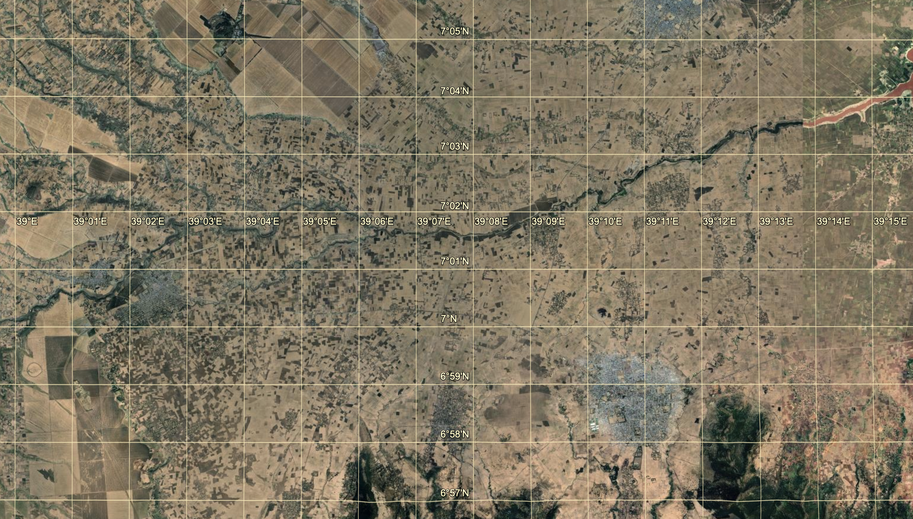
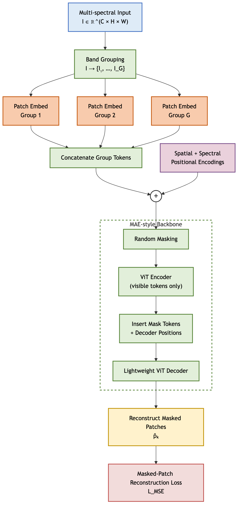
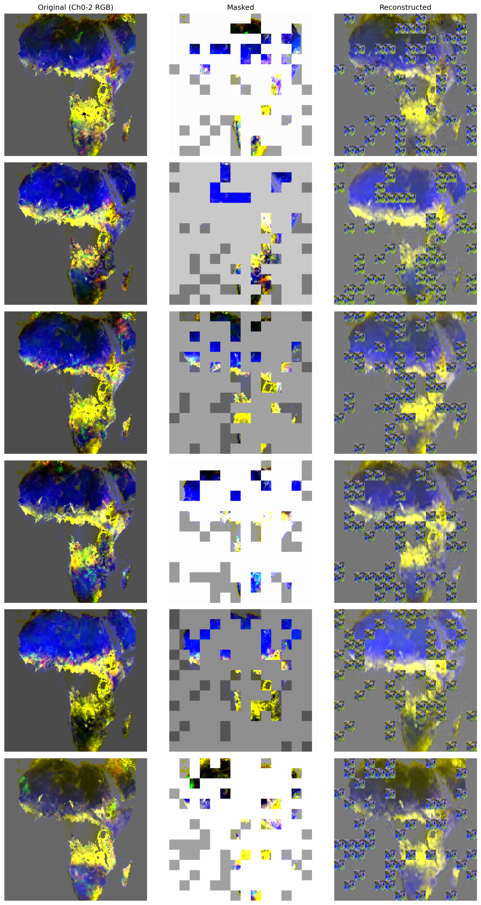
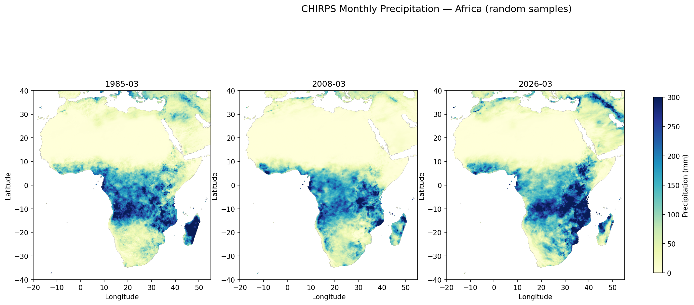
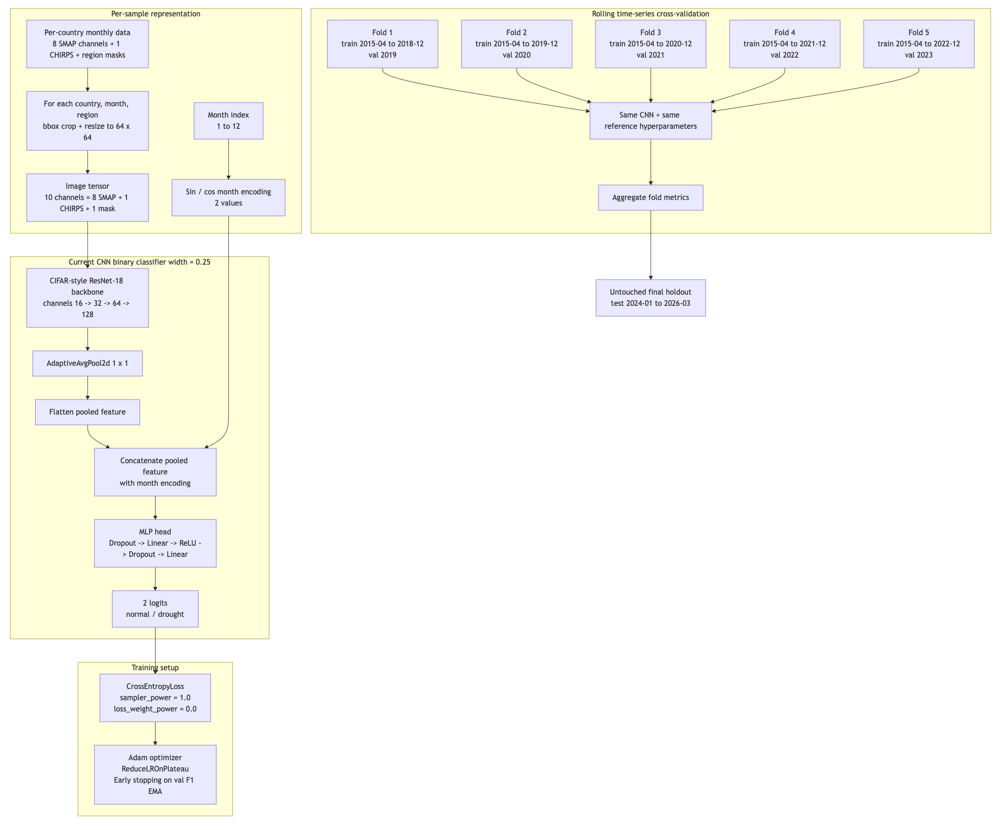

### Problem:

Nearly 700 M live in extreme poverty. Sub-saharan Africa accounts for around 16% of the world's population and yet they represent about 67% of those living in extreme poverty.
By analyzing the conomic landscape of vulnerable populations more individually, policymakers can develop more tailored strategies to address the issue.

in many of the most affected countries, a relatively large share of GPD depends on agriculture. This makes them vulnerable to drought - a problem that climate change can further increase. The consequences besides economic stress, may lead to a cascade of social consequences affecting food secutiry, livelihoods, migration, long-term stabilty.

Source: World Bank, Poor Economics. [1](https://data.worldbank.org), [2](https://dn790000.ca.archive.org/0/items/HistoryOfTheoriesAndIdeologiesThatGotUsInTheTurmoil/%5BAbhijit_Banerjee%2C_Esther_Duflo%5D_Poor_Economics.pdf)

Open-source satellite spectral data offers a cost-effective way to monitor environmental stress across agricultural regions. When combined with CNN or ViT models, these may detect spatial patterns linked to drought / land stress. [3](https://www.mdpi.com/1424-8220/25/2/472), [4](https://www.mdpi.com/2673-4591/118/1/34)

---

* Ethiopia $\rightarrow$ IMF projects real GPD growth rate of $> 7$% for 2026 while government projects $10.2$% agricultural yields
* Agriculture makes up $35$% of GDP and represents $~75$% total export earnings with coffee as best trade
* Agricultural sector employs $~70$% of total population
* $~80$% population lives in rural areas
  * $~75$% of farmers are small family farmers
* Stable crops grown to meet subsistence needs are teff, maize, wheat, barley, sorghum

---

[DATA SOURCE: SMAP L3 Radiometer Global Daily 36 km EASE-Grid Soil Moisture V009](data_processing/data_source.md)

$1$ pixel $=$ $36km$ x $36km$ $(1296km^2)$

---

*Root zone soil moisture*: Water that is available to plants usually considered to be in the upper 200 cm of soil. An accurate depiction can provide valuable insights for agricultural monitoring, weather, prediction, drought/flood warnings. 

*Surface soil moisture*: Shallow near-surface layer, often upper 5-10 cm.

Soil moisture is also dependent on soil type and vegetation.

[Source](https://www.drought.gov/topics/soil-moisture)

---

* **Swath gaps:** Spaces between satellite observation tracks where no data is collected during a given pass or compositing period.
* Retrieval ~6AM local overpass for passive soil-moisture as early morning conditions are thermally more uniform.

---

SatMAE architecture:

  

---

### Pretraining SatMAE with SMAP L3:

**Pre-trained a SatMAE model but the amount of labeled data for downstream fine-tuning was insufficient.**

---

### Reference dataset 
**Climate Hazards Group InfraRed Precipitation with Station data (CHIRPS)**

---

### CIFAR-style ResNet-18 backbone CNN + Time-Series CV

